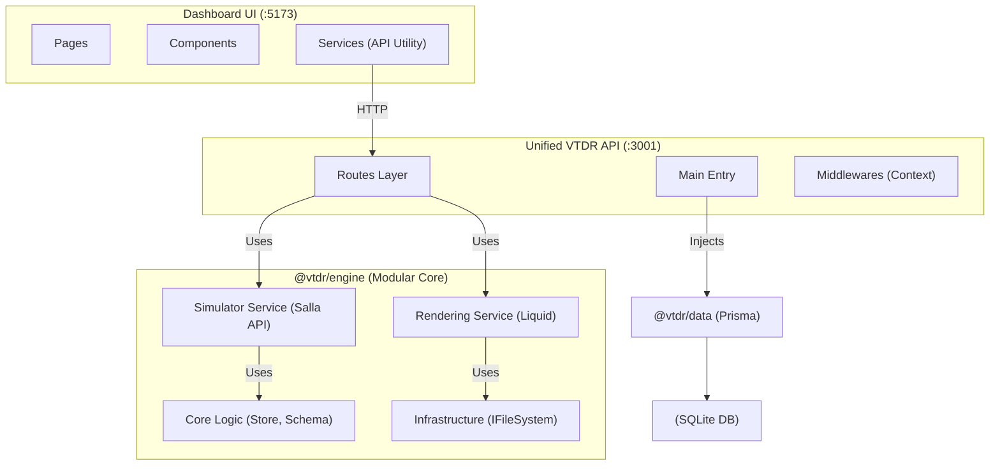

# VTDR Project Architecture & Developer Guide

This document serves as the primary technical reference for the VTDR project, outlining its decoupled architecture, library connections, and development workflows.

## 🏗️ Architectural Overview (Library Connections)

VTDR is built on a modular, decoupled architecture where logic, data, and presentation are strictly separated across three layers.



### Library Responsibilities

- **`@vtdr/contracts`**: The "Common Language". Defines all shared types and repository interfaces. No implementation logic exists here.
- **`@vtdr/data`**: The "Persistence Layer". Implements repository interfaces using **Prisma** and **SQLite**.
- **`@vtdr/engine`**: The "Core Logic". Now structured into specialized modules:
  - `core/`: Store logic and schema management.
  - `rendering/`: Theme registry, loader, and Liquid renderer.
  - `providers/`: External-facing simulator services (formerly "Mock").
  - `infra/`: Abstractions for system resources (e.g., `IFileSystem`).
  - `webhooks/`: Event dispatching system.
- **`Unified VTDR API (Port 3001)`**: The "Central Hub". Features a modular routing layer and unified context middleware for handling store-specific requests.

---

## 🚀 Getting Started (Development)

From the project root, run:

```powershell
npm run dev
```

This command executes the master orchestration script (`vtdr-dev.js`) which starts:

1. **Unified VTDR API** (Port 3001) - Handles engine logic, storefront rendering, and Salla simulator endpoints.
2. **Dashboard UI** (Port 5173) - React management interface.
3. **Prisma Studio** (Port 5555) - Direct database management tool.

---

## 🏛️ Technical Implementation Details

### Infrastructure Abstraction (`IFileSystem`)

The engine is decoupled from the host operating system's filesystem via the `IFileSystem` interface. This enables:

- **Testability**: Mocking filesystem interactions without disk I/O.
- **Flexibility**: Swapping `LocalFileSystem` for cloud storage (S3/GridFS) in the future.

### Salla Platform Simulator

The API on Port 3001 provides a compatibility layer for Salla's standard endpoints (e.g., `/api/v1/store/info`). These are powered by the `SimulatorService` within the engine.

### UI Organization

The React application follows a strict directory standard:

- `src/components/`: Pure UI and shared complex components (e.g., `ThemeSettingsPanel`).
- `src/services/`: API client utilities and global state logic.
- `src/pages/`: Route-level container components.

---

## 📝 Best Practices for Contributors

1. **Type Safety**: Define all new entities in `@vtdr/contracts`.
2. **DI (Dependency Injection)**: Always inject infrastructure (like `IFileSystem`) into services rather than instantiating them internally.
3. **Route Isolation**: Add new API functionality by creating a dedicated route file in `apps/api/src/routes` and registering it in the main `index.ts`.
4. **Simulator Terminology**: Use the term "Simulator" instead of "Mock" for services that provide Salla platform compatibility.
