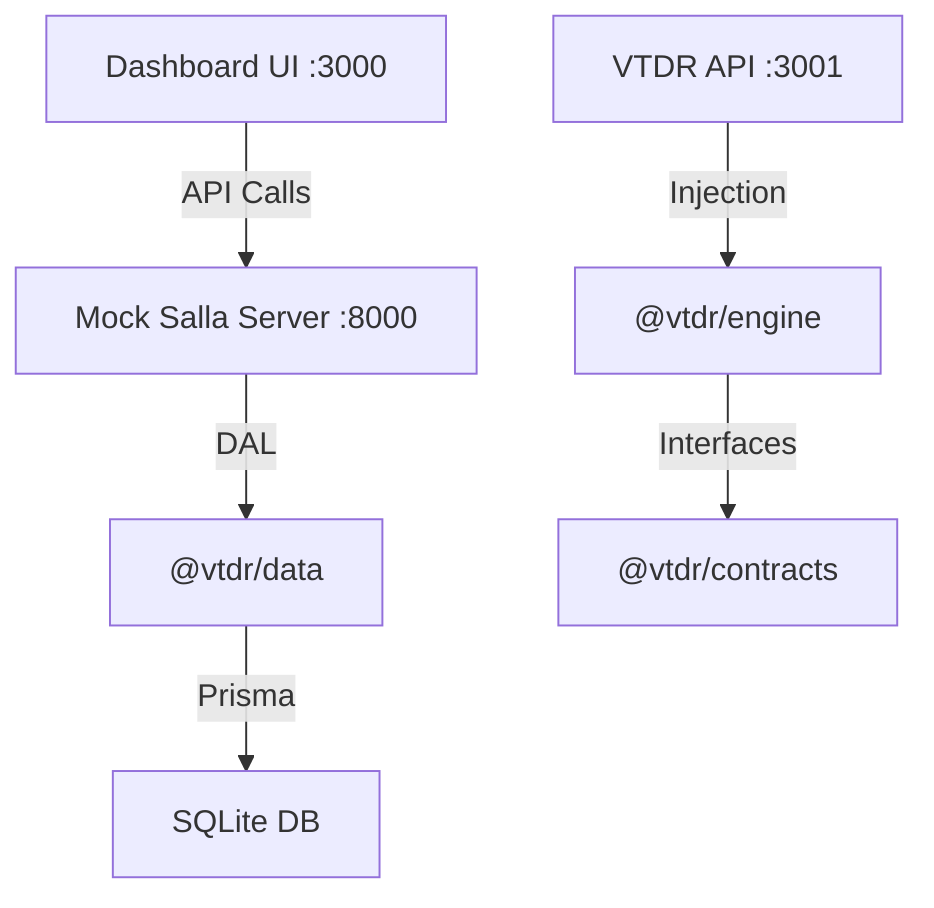

# Developer Documentation (VTDR)

This file serves as the main development guide for the **Virtual Theme Development Runtime (VTDR)**.

## 🌟 Quick Start

To launch the complete development environment, run:

```powershell
npm run dev
```

## 🏗️ Architecture & Library Connections

The project follows a strict **Clean Architecture** pattern to ensure decoupling between logic and data.



### Core Libraries

| Library             | Purpose                     | Dependency Rule            |
| :------------------ | :-------------------------- | :------------------------- |
| **@vtdr/contracts** | Definitions and Interfaces  | Zero dependencies.         |
| **@vtdr/data**      | Persistence (Prisma/SQLite) | Depends on contracts.      |
| **@vtdr/engine**    | Pure Simulation Logic       | Depends ONLY on contracts. |

---

## 🛠️ Development Workflow

### 1. Modifying Data Models

If you change the database schema:

1. Edit `packages/data/prisma/schema.prisma`.
2. Run `npx prisma generate` in `packages/data`.
3. Update the corresponding repository in `prisma-repository.ts`.

### 2. Testing the Mock Server

The Mock Salla Server (`st-server.js`) handles platform requests. If a new Salla API is needed:

1. Add the endpoint to `st-server.js`.
2. Use the `scenarioRepo` to fetch data based on the `context-store-id` header.

### 3. Debugging

- **Prisma Studio (Port 5555)**: Use this to inspect and edit database values in real-time.
- **Mock Salla Logs**: Monitor the terminal running `st-server.js` for incoming platform requests.

## 📜 Coding Standards

- **Decoupling**: Never import `@prisma/client` directly into the engine.
- **Typing**: All shared types must reside in `@vtdr/contracts`.
- **Modularity**: Keep the Mock Server logic simple; delegate complex data management to the repositories.
